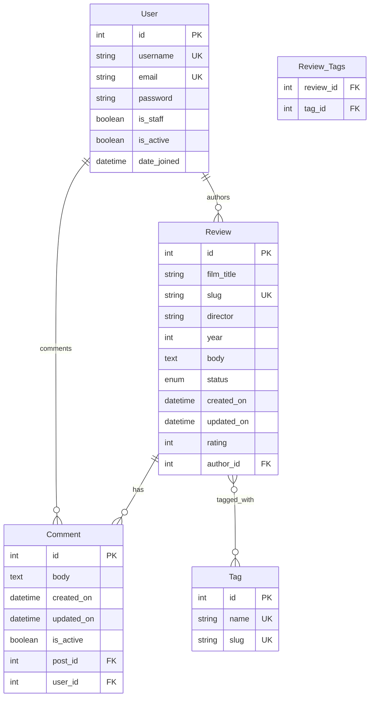
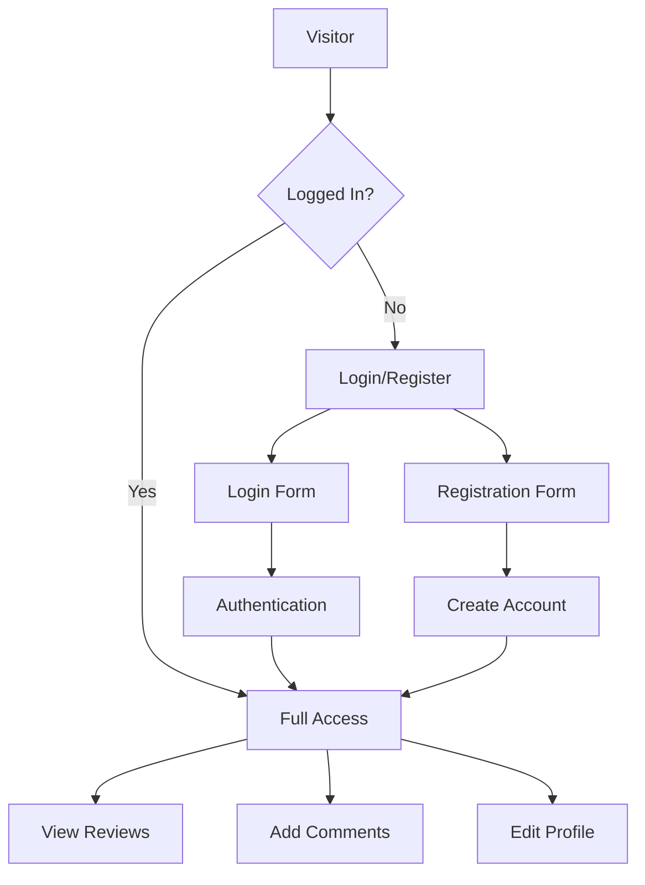
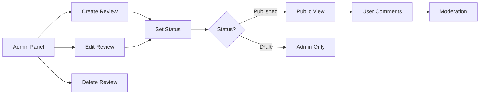

# 🎬 Horror Haven - Horror Film Review Site

A Django-based horror film review website with a stunning dark red theme, 5-star rating system, and enhanced user experience features.

## ✨ Latest Features & Improvements

### 🎨 **Enhanced Visual Design**
- **Beautiful yellow headers** (#ffd700) for consistent branding
- **Horror-themed color scheme** with blood red (#8B0000) and dark gradients
- **Professional typography** with text shadows and hover effects
- **Responsive design** that works on all devices

### 🔐 **Improved User Experience**
- **Enhanced registration form** with clear "Re-enter Password" labeling
- **Sleek comment system** without unnecessary labels
- **Visited link indicators** with eye icons (👁️) and "READ" badges
- **Professional comment buttons** with horror theme styling
- **Better form styling** with focus effects and animations

### 💬 **Comment System Enhancements**
- **Custom comment textarea** with horror film placeholder text
- **Enhanced submit buttons** with gradient styling and hover effects
- **Improved comment date visibility** with gold color scheme
- **Professional form layout** that matches the site theme

### 🎭 **Horror Theme Consistency**
- **Unified color palette** throughout the application
- **Consistent button styling** with blood red gradients
- **Enhanced hover effects** with glow animations
- **Professional header design** without distracting links

## 🏗️ Database Structure (ERD)

### **Main Database Schema**


### **User Authentication Flow**


### **Review Management System**


## 🚀 Local Development

### **Prerequisites**
- Python 3.12+
- pip
- Git

### **Setup Steps**
1. **Clone the repository:**
   ```bash
   git clone https://github.com/Lloyd952/horror-haven.git
   cd horror-haven
   ```

2. **Install dependencies:**
   ```bash
   pip install -r requirements.txt
   ```

3. **Run migrations:**
   ```bash
   python manage.py migrate
   ```

4. **Create superuser:**
   ```bash
   python manage.py createsuperuser
   ```

5. **Run the development server:**
   ```bash
   python manage.py runserver
   ```

6. **Visit your site:**
   ```
   http://127.0.0.1:8000/
   ```

## 🌐 Heroku Deployment

### **Live Site**
**🎬 Horror Haven is live at:** https://horror-haven-be1b58f3699e.herokuapp.com/

### **Deployment Features**
- **Automatic builds** from GitHub main branch
- **PostgreSQL database** for production data
- **Static file optimization** with WhiteNoise
- **Professional domain** with SSL encryption

### **Environment Configuration**
```bash
# Set production environment variables
heroku config:set SECRET_KEY="your-secret-key"
heroku config:set DEBUG=False
heroku config:set ALLOWED_HOSTS="your-app.herokuapp.com"
```

## 🎯 Key Features

### **Review System**
- **5-star rating system** with visual indicators
- **Rich metadata** including director, year, and tags
- **Status management** (Published/Draft)
- **SEO-friendly URLs** with slug-based routing

### **User Management**
- **Secure authentication** with Django's built-in system
- **User registration** with email verification
- **Profile management** and comment history
- **Admin panel** for content moderation

### **Content Organization**
- **Tag-based categorization** for easy discovery
- **Search and filtering** capabilities
- **Pagination** for large review collections
- **Responsive grid layout** for optimal viewing

## 🛠️ Technical Stack

### **Backend Framework**
- **Django 5.0.7** - Modern Python web framework
- **PostgreSQL** - Production database
- **SQLite** - Development database

### **Frontend Technologies**
- **Custom CSS** - Horror-themed styling
- **Responsive design** - Mobile-first approach
- **JavaScript** - Enhanced user interactions
- **HTML5** - Semantic markup

### **Deployment & Infrastructure**
- **Heroku** - Cloud hosting platform
- **WhiteNoise** - Static file serving
- **Gunicorn** - WSGI server
- **Git** - Version control

### **Third-Party Packages**
- **django-taggit** - Tag management
- **django-extensions** - Development utilities
- **psycopg2-binary** - PostgreSQL adapter

## 📁 Project Structure

```
horror-haven/
├── 📁 account/                 # User authentication app
│   ├── 📄 models.py           # User models
│   ├── 📄 views.py            # Auth views
│   ├── 📄 forms.py            # Registration forms
│   └── 📁 templates/          # Auth templates
│
├── 📁 blog/                    # Main application
│   ├── 📄 models.py           # Review & Comment models
│   ├── 📄 views.py            # Review views & logic
│   ├── 📄 forms.py            # Comment forms
│   ├── 📁 templates/          # HTML templates
│   │   ├── 📁 post/           # Review templates
│   │   └── 📁 includes/       # Reusable components
│   └── 📁 static/             # Static assets
│       ├── 📁 css/            # Horror-themed stylesheets
│       └── 📁 js/             # JavaScript functionality
│
├── 📁 mysite/                  # Project configuration
│   ├── 📄 settings.py         # Django settings
│   ├── 📄 urls.py             # URL routing
│   └── 📄 wsgi.py             # WSGI configuration
│
├── 📄 requirements.txt         # Python dependencies
├── 📄 Procfile                # Heroku deployment
├── 📄 runtime.txt             # Python version
└── 📄 README.md               # This file
```

## 🔧 Development Workflow

### **Code Quality**
- **Clean, readable code** following Django best practices
- **Consistent styling** with CSS custom properties
- **Responsive design** principles
- **Accessibility considerations**

### **Testing & Quality Assurance**
- **Comprehensive automated testing** with Django test framework
- **Manual testing procedures** for functionality and usability
- **Test coverage targets** of 90%+ for critical components
- **Continuous integration** with automated test execution
- **Security testing** for authentication and data validation

### **Version Control**
- **Git workflow** with feature branches
- **Meaningful commit messages** for project history
- **Regular deployments** to Heroku
- **GitHub integration** for collaboration

## 🧪 Testing & Quality Assurance

### **Automated Testing**

The project includes comprehensive automated tests covering:

- **Models**: Review and Comment model functionality
- **Views**: All view endpoints and user interactions
- **Forms**: Form validation and data processing
- **Authentication**: User registration, login, and access control
- **Security**: CSRF protection, password hashing, session management
- **Responsiveness**: Static file loading and template rendering

#### **Running Tests**

```bash
# Run all tests
python manage.py test

# Run specific app tests
python manage.py test blog
python manage.py test account

# Run with coverage report
coverage run --source='.' manage.py test
coverage report
coverage html  # Generates detailed HTML report
```

#### **Test Coverage Goals**

- **Models**: 100% coverage
- **Views**: 95%+ coverage  
- **Forms**: 100% coverage
- **URLs**: 100% coverage
- **Overall**: 90%+ coverage target

### **Manual Testing Procedures**

Comprehensive manual testing procedures are documented in `TESTING.md` covering:

- **User Authentication**: Registration, login, logout workflows
- **Review Management**: Display, navigation, and interaction
- **Comment System**: Adding, editing, and managing comments
- **Responsive Design**: Cross-device and cross-browser testing
- **Data Management**: CRUD operations and validation
- **Performance**: Page load times and database efficiency
- **Security**: Authentication, access control, and input validation

### **Testing Tools & Infrastructure**

- **Django Test Framework**: Built-in testing capabilities
- **Coverage.py**: Code coverage analysis
- **GitHub Actions**: Automated testing pipeline
- **Heroku**: Staging and production deployment testing
- **Browser DevTools**: Frontend testing and debugging

### **Quality Metrics**

- **Test Reliability**: Minimize flaky tests
- **Execution Time**: Target < 30 seconds for full test suite
- **Bug Detection**: Track testing vs. production issue discovery
- **Code Quality**: Maintain high standards with regular reviews

## 🌟 Sample Content

### **Featured Horror Reviews**
- **The Shining (1980)** - Psychological horror masterpiece
- **Hereditary (2018)** - Modern horror classic
- **The Texas Chain Saw Massacre (1974)** - Revolutionary slasher
- **A Nightmare on Elm Street (1984)** - Supernatural horror
- **The Exorcist (1973)** - Religious horror classic

### **Tag Categories**
- **Psychological** - Mind-bending horror
- **Slasher** - Traditional slasher films
- **Supernatural** - Ghosts and demons
- **Found Footage** - Documentary-style horror
- **Body Horror** - Physical transformation themes

## 🤝 Contributing

We welcome contributions to make Horror Haven even better!

### **How to Contribute**
1. **Fork the repository**
2. **Create a feature branch**
3. **Make your improvements**
4. **Submit a pull request**
5. **Join the horror community!**

### **Development Guidelines**
- Follow Django coding standards
- Test your changes thoroughly
- Update documentation as needed
- Maintain the horror theme aesthetic

## 📞 Support & Contact

- **GitHub Issues:** Report bugs or request features
- **Live Site:** https://horror-haven-be1b58f3699e.herokuapp.com/
- **Repository:** https://github.com/Lloyd952/horror-haven

## 📜 License

This project is open source and available under the [MIT License](LICENSE).

